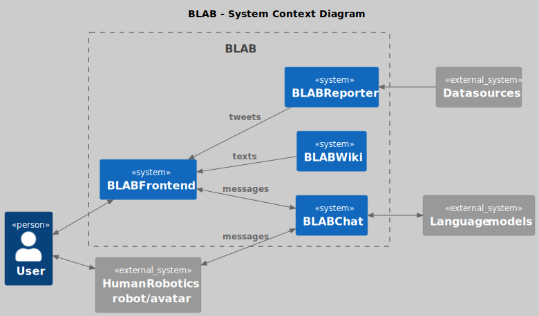
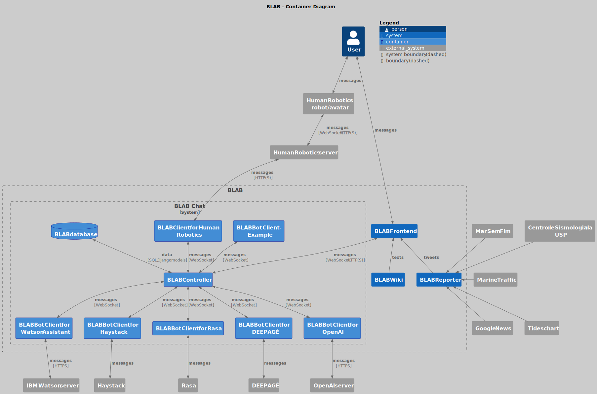

# BLAB

<!-- Run `make` to rebuild the diagrams. --> 

This repository provides an overview of BLAB (BLue Amazon Brain) and its components. BLAB has not been deployed to
production at the time of writing, but its source is available and you can install some or all of its components on your
PC or server.

  

BLAB Portal is a website that provides access to chatbots and other services. Its repository
is [BLAB Front-end](../../../blab-frontend), and it was developed with React Framework.
See [README.md](../../../blab-frontend/blob/main/README.md) in that repository for installation instructions.

## 1. Services:

Currently, BLAB consists of three services:

- BLAB-Chat
- BLAB-Reporter
- BLAB-Wiki

### 1.1 BLAB-Chat

BLAB is managed by a central controller, [BLAB Controller](../../../blab-controller), developed in Python. The
controller is a web server that receives user requests, executes the appropriate actions using several BLAB components
and returns the results. See the file [INSTALL.md](../../../blab-controller/blob/main/INSTALL.md)
for installation instructions.

The controller contains two basic bots (ECHO and Calculator) for demonstration purposes:

- ECHO, which echoes every message in upper case;
- Calculator, which evaluates the result of simple arithmetic expressions.

In order to integrate other bots, see
[these instructions](../../../blab-controller/blob/main/ADDING_BOTS.md).

We have written the intermediate layers to integrate BLAB Controller with
a few answerers.

| Service/Framework                                                               | Description                                                                                                                                                                                                                                                                                                                                                                         | BLAB client                                                   | Requirements                  |
|---------------------------------------------------------------------------------|-------------------------------------------------------------------------------------------------------------------------------------------------------------------------------------------------------------------------------------------------------------------------------------------------------------------------------------------------------------------------------------|---------------------------------------------------------------|-------------------------------|
| [IBM Watson Assistant](https://cloud.ibm.com/catalog/services/watson-assistant) | *"Watson Assistant is a platform built for business users, so your teams can design, deploy and manage conversational AI"* [[definition source]](https://www.ibm.com/downloads/cas/ZDJDQLGV)  [[documentation]](https://cloud.ibm.com/apidocs/assistant-v2)                                                                                                                         | [Watson Assistant bot for BLAB](../../../blab-chatbot-watson) | IBM credentials               |
| [DEEPAGÉ](../../../deepage)                                                     | DEEPAGÉ is a set of *“QA systems that combine in novel ways the BM25 algorithm, a sparse retrieval technique, with PTT5, a pre-trained state-of-the-art language model”* to answer *“questions in Portuguese about the Brazilian Environment”* [[paper]](https://doi.org/10.1007/978-3-030-91699-2_29) [[preprint]](https://doi.org/10.48550/arXiv.2110.10015)                      | [DEEPAGÉ bot for BLAB](../../../blab-chatbot-deepage)         | trained model and corpus data |                              |
| [Haystack](https://haystack.deepset.ai/)                                        | *“Haystack is an open-source framework for building search systems that work intelligently over large document collections”*  [[definition source]](https://haystack.deepset.ai/overview/intro) [[documentation]](https://docs.haystack.deepset.ai/docs)                                                                                                                            | [Haystack bot for BLAB](../../../blab-chatbot-haystack)       | trained model and corpus data |
| [Rasa](https://rasa.com/)                                                       | Rasa is *“open source framework for building chat and voice-based AI assistants”* [[documentation]](https://rasa.com/docs/rasa/)                                                                                                                                                                                                                                                    | [Rasa bot for BLAB](../../../blab-chatbot-rasa)               | model and local endpoint      |
| [OpenAI models](https://platform.openai.com/docs/models)                        | OpenAI models _“are advanced language processing tools that can generate, classify, and summarize text with high levels of coherence and accuracy”_ _“using a technology called deep learning, which leverages large amounts of data to train an AI system”_ [[definition source]](https://openai.com/research/overview) [[documentation]](https://platform.openai.com/docs/models) | [OpenAI bot for BLAB](../../../blab-chatbot-openai)           | OpenAI credentials            |

If you want to integrate other bots with BLAB, see [this generic example](../../../blab-chatbot-example).

### 1.2 BLAB-Reporter

[BLAB Reporter](https://github.com/C4AI/blab-reporter) is an application that collects data related to the Blue Amazon
from multiple sources
and publishes it on Twitter ([@BLAB_Reporter](https://twitter.com/BLAB_Reporter))
in natural language (Portuguese).

### 1.3 BLAB-Wiki

BLAB-Wiki is a set of curated texts in Portuguese about the Blue Amazon that can be used as a resource to build
conversational agents. They have been written by undergraduate Oceanography students and revised by experts. Some of the
texts are available at [a temporary server](https://c2dt02.duckdns.org/w/index.php) (only preliminary versions).

## 2. Published papers

1. [_The BLue Amazon Brain (BLAB): A Modular Architecture of Services about the Brazilian Maritime
   Territory_](https://oceania.inria.cl/assets/pdfs/aimocc22/paper-05.pdf), published in [AIMOCC 2022 \(_AI: Modeling
   Oceans and Climate Change_\)](https://oceania.inria.cl/#aimocc-2022), which was one of
   the [IJCAI 2022](https://ijcai-22.org/) workshops.
   A [preprint](https://doi.org/10.48550/arXiv.2209.07928) is also availabele.
